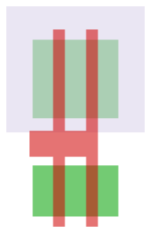

# Ders 0 — Bir çipin içine bakmak

Bu ders, donanım bilmeyen birine layout okumayı sıfırdan anlatır. Sonunda şunu
yapabiliyor olacaksın: bir GDS dosyasındaki herhangi bir dikdörtgeni gösterip
"bu şu katman, şu işe yarıyor" diyebilmek. Faz 0'ın çıkış kriteri buydu.

Teknik terimleri İngilizce bırakıyorum, çünkü araçlarda ve dökümanlarda onları
o isimle göreceksin.

---

## 1. Elimizde ne var

`puzzle/puzzle.gds` diye bir dosya. İçinde bir çipin **fiziksel çizimi** var.
Şeması yok, kodu yok, isimleri silinmiş. Sadece geometri: on binlerce dikdörtgen.

Görevimiz bu dikdörtgenlerden geriye doğru gidip devrenin ne hesapladığını
bulmak. Yani üretim talimatından tasarımı geri türetmek.

Bunu anlamak için önce şu soruyu cevaplamak gerek: **bu dikdörtgenler neyi
temsil ediyor?**

---

## 2. Çip fiziksel olarak nedir

Bir çip, silisyum bir levhanın (wafer) üzerine **katman katman** malzeme
biriktirilerek yapılır. Silisyum kumdan elde edilir — bu arada bulduğumuz
easter egg'in esprisi de buydu, `PER ARENAM AD ASTRA`, "kumdan yıldızlara".

Süreç kabaca şöyle: bir malzeme tabakası kaplanır, üzerine ışıkla bir desen
basılır, desenin dışı kazınır, geriye istenen şekil kalır. Sonra bir sonraki
tabaka. Bu işlem onlarca kez tekrarlanır.

Her tabakanın deseni bir **maske** ile belirlenir. İşte GDS dosyası tam olarak
bu maskelerin çizimidir. Yani elimizdeki şey bir devre şeması değil, **bir
üretim talimatı**.

Buradan çok önemli bir sonuç çıkıyor: dosyadaki her dikdörtgenin bir katman
numarası var, ve o numara "bu şekil hangi maskeye ait" demek. Aynı yerdeki iki
dikdörtgen farklı katmanlardaysa, fiziksel olarak üst üste duran iki farklı
malzemedir.

Bir baskı işi gibi düşün: aynı kâğıda önce mavi, sonra kırmızı, sonra siyah
basılır. Katman numarası "hangi renk" demek.

---

## 3. Transistör nedir

Çipteki tek gerçek "eleman" transistördür. Geri kalan her şey transistörleri
birbirine bağlayan tellerdir.

Kullandığımız tip **MOSFET**. Üç ucu var:

- **source** — akımın girdiği yer
- **drain** — akımın çıktığı yer
- **gate** — musluğun kolu

Çalışma mantığı bir musluk gibi: gate'e voltaj uygularsan source ile drain
arası iletken hale gelir, akım geçer. Voltajı kaldırırsan geçmez. Yani
transistör **voltajla kontrol edilen bir anahtar**.

Fiziksel yapısı şöyle: yarı iletken bir şerit vardır (buna **diff** denir,
diffusion'dan). Bu şeridin üzerinden dik olarak bir kapı geçer (**poly**,
polysilicon'dan). İkisinin arasında çok ince bir yalıtkan tabaka vardır — poly
diff'e değmez, üstünden geçer.

**İşte bu dersin en önemli cümlesi:**

> Poly'nin diff'i kestiği her yerde bir transistör vardır.

Kesişimin altında kalan diff kısmı gate'in kontrol ettiği kanaldır. Kesişimin
iki yanında kalan diff parçaları da source ve drain olur.

```
        poly (gate)
            │
    ────────┼────────      ← üstten görünüş
    │       │       │
    │ diff  │  diff │      sol parça = source
    ────────┼────────      sağ parça = drain
            │              kesişim = transistör
```

Yani layout'ta transistör diye ayrı bir şekil aramıyoruz. Transistör, iki
katmanın **kesişmesinden doğuyor**. Bunu göremezsen layout okuyamazsın.

---

## 4. Neden iki çeşit transistör var

İki tip MOSFET var:

- **NMOS** — gate'e 1 verince iletir. Sıfırı (GND'yi) iyi aktarır.
- **PMOS** — gate'e 0 verince iletir. Biri (VDD'yi) iyi aktarır.

Her biri sadece bir tarafta iyi. NMOS ile 1 üretmeye çalışırsan zayıf bir 1
alırsın, PMOS ile 0 üretirsen zayıf bir 0 alırsın.

Çözüm **CMOS**: ikisini birlikte kullan. Çıkışı VDD'ye bağlaman gerektiğinde
PMOS'u aç, GND'ye bağlaman gerektiğinde NMOS'u aç. Hiçbir zaman ikisi birden
açık olmaz, dolayısıyla VDD'den GND'ye sürekli akım akmaz. Statik güç tüketimi
neredeyse sıfır. Bugün kullandığımız bütün dijital çipler bu yüzden CMOS.

Ama bir sorun var. PMOS'un source/drain bölgeleri **p tipi** katkılı olmalı ve
altında **n tipi** bir taban gerekiyor. Wafer'ın kendisi p tipi. Dolayısıyla
PMOS'ları koyabilmek için önce n tipi bir havuz kazmak gerekiyor.

O havuza **nwell** deniyor. Layout'ta gördüğün büyük açık renkli bölge budur:
**PMOS'ların içinde oturduğu havuz.**

Bu yüzden her standard cell'in üst yarısı PMOS, alt yarısı NMOS olur. nwell
üstte olduğu için.

---

## 5. En basit kapı: invertör

Girişi tersine çeviren kapı. 0 verirsen 1, 1 verirsen 0 üretir. İki
transistörle kurulur:

```
            VDD (VPWR)
             │
           ──┴──
    A ─────┤ PMOS       A=0 → PMOS açık → Y, VDD'ye bağlanır → Y=1
           ──┬──
             ├────── Y (çıkış)
           ──┴──
    A ─────┤ NMOS       A=1 → NMOS açık → Y, GND'ye bağlanır → Y=0
           ──┬──
             │
            GND (VGND)
```

İki transistörün gate'i **ortak** — ikisi de A girişine bağlı. Drain'leri de
ortak — ikisi de Y çıkışını sürüyor. Source'ları ise beslemeye gidiyor: PMOS
VDD'ye, NMOS GND'ye.

Bu resmi aklında tut, çünkü şimdi gerçeğine bakacağız.

---

## 6. Gerçek invertörü okumak

`sky130_fd_sc_hd__inv_2` hücresinin device katmanlarını çizdirdim:



Üreten komut:

```
python tools/render_cell.py puzzle/puzzle.gds sky130_fd_sc_hd__inv_2 \
       docs/dersler/img/inv2-device.svg --layers device
```

Bu görüntüde sadece üç katman var, ve toplam **dört şekil**. Gerçek
koordinatlarıyla:

| Katman | Konum (µm) | Ne olduğu |
|---|---|---|
| nwell | y 1.305 .. 2.910 | üst yarıyı kaplayan havuz |
| diff | y 0.235 .. 0.885, yükseklik **0.650** | alt şerit → NMOS |
| diff | y 1.485 .. 2.485, yükseklik **1.000** | üst şerit → PMOS |
| poly | x 0.405..0.555 ve 0.825..0.975, genişlik **0.150** | iki dikey parmak |

Şimdi bu tabloyu birlikte okuyalım. Üç şey söylüyor.

### Üst diff PMOS, alt diff NMOS

Çünkü nwell y 1.305'ten başlıyor ve üst diff (1.485..2.485) tam onun içinde
kalıyor. Alt diff (0.235..0.885) ise nwell'in tamamen dışında.

Bunu bağımsız olarak doğrulayan iki katman daha var: **psdm** (P+ katkı maskesi)
y 1.355..2.910 aralığında, yani üstte. **nsdm** (N+ katkı maskesi) y
−0.190..1.015 aralığında, yani altta. Üstteki diff p tipi katkılanmış, alttaki
n tipi. Tam beklediğimiz gibi.

Bu, layout okumanın tipik hissi: aynı olguyu birbirinden bağımsız üç katman
doğruluyor. Bir yorumun doğruluğunu böyle test edersin.

### PMOS neden daha kalın

Alt diff 0.650 µm yüksekliğinde, üst diff 1.000 µm. Yaklaşık 1.5 katı.

Sebebi fizik: PMOS'ta akımı taşıyan yük taşıyıcıları (delikler), NMOS'takilerden
(elektronlar) daha yavaş hareket eder. Aynı genişlikte bir PMOS, NMOS'tan daha
az akım verir. Yükselen kenar ile düşen kenarın aynı hızda olmasını istiyorsan
PMOS'u daha geniş çizmen gerekir.

Yani ekrandaki bu boyut farkı estetik bir tercih değil, **yarı iletken
fiziğinin çizime yansımış hali**. Bundan sonra baktığın her CMOS hücresinde üst
şeridin daha kalın olduğunu göreceksin.

### Neden iki parmak var, tek değil

Poly tek bir bağlantılı şekil ama iki dikey parmağı var (x 0.405..0.555 ve
0.825..0.975), ortada y 0.995..1.325 seviyesinde yatay bir köprüyle
birleşiyorlar.

İki parmak, her diff şeridini iki kez kesiyor. Yani aslında **4 transistör** var:
2 NMOS altta, 2 PMOS üstte. Gate'leri ortak olduğu için ikişerli paralel
çalışıyorlar, ve paralel iki transistör tek transistörün iki katı akım verir.

Hücrenin adındaki `_2` işte bu: **drive strength 2**. Daha uzun bir teli veya
daha çok girişi sürmesi gereken bir kapı, daha güçlü versiyonundan seçilir.
Aynı mantık kapısının `_1`, `_2`, `_4`, `_8` versiyonları kütüphanede yan yana
durur; mantığı aynı, sürme gücü farklıdır.

Parmak genişliği 0.150 µm. Bu, sky130'un çizilebilir en dar poly genişliği.
Ufak bir not: proses adı "130 nm" ama çizilen gate 150 nm — proses isimleri
doğrudan bir ölçüye karşılık gelmez, pazarlama ve tarihsel süreklilik taşır.

---

## 7. Transistörleri bağlamak: katman merdiveni

Transistörler var ama birbirine bağlanmaları lazım. Bunun için üst üste binen
iletken katmanlar kullanılır. Aradaki geçişlere **via** denir (en alttakilerin
özel isimleri var).

```
   met5   ▲  en üst, en kalın, en uzak mesafeler
   via4   │
   met4   │
   via3   │
   met3   │
   via2   │
   met2   │
   via    │
   met1   │
   mcon   │
   li1    │  local interconnect, hücre içi kısa bağlantılar
   licon1 │
   diff / poly  ▼  transistörlerin kendisi
```

Merdiven aşağıdan yukarı: transistörden çıkan bağlantı `licon1` ile `li1`'e
tırmanır, `mcon` ile `met1`'e, sonra `via`, `via2`, `via3`, `via4` ile
`met2`...`met5`'e kadar çıkar.

Alt katmanlar ince ve kısa mesafeler için, üst katmanlar kalın ve uzun
mesafeler için. Besleme (VPWR/VGND) genelde üst katmanlardan dağıtılır, çünkü
kalın metal daha az direnç gösterir.

**Faz 2'de yapacağımız "connectivity extraction" tam olarak bu merdiveni
tersten tırmanmak olacak:** hangi metal parçası hangi via ile hangi metal
parçasına bağlı, oradan hangi pine iniyor. Bunu bulunca netlist elimizde olur.

Şimdi aynı invertörün tüm katmanlarıyla haline bakalım:


`li1` şekillerini koordinatlarıyla okuyalım — hikâyenin tamamı burada:

| li1 şekli | Ne olduğu |
|---|---|
| x 0.000..1.380, y 1.495..2.805 | üst besleme rayı, PMOS source'larını VPWR'a bağlar |
| x 0.000..1.380, y −0.085..0.905 | alt besleme rayı, NMOS source'larını VGND'ye bağlar |
| x 0.525..0.855, y 0.255..2.465 | **çıkış Y** — alttan üste uzanıp iki drain'i birleştiriyor |
| x 0.105..0.435, y 1.075..1.325 | **giriş A** — gate'e giden küçük ped |

Bölüm 5'teki şemayla birebir örtüşüyor. Ortadaki dikey şerit, NMOS drain'i ile
PMOS drain'ini birleştirip çıkışı oluşturuyor. Dış kenarlardaki iki temas sütunu
source'ları beslemeye bağlıyor.

Ve hücre bunu bize **söylüyor** da: geometrinin üstünde metin etiketleri var.

```
67/5 @(0.230, 1.190) 'A'      ← giriş pedinin üstünde
67/5 @(0.690, 0.850) 'Y'      ← çıkış şeridinin üstünde
68/5 @(0.230, 2.720) 'VPWR'
68/5 @(0.230, 0.000) 'VGND'
83/44 @(0.000, 0.000) 'inv_2' ← hücrenin kimliği
```

Bu büyük bir şans. Puzzle GDS'inde bu etiketler silinmemiş. Yani "bu geometri
hangi pin" sorusunu çözmemize gerek yok, hücre kendi pinlerini isimleriyle
söylüyor. Faz 2'nin en zahmetli kısmı büyük ölçüde hediye edilmiş durumda.

---

## 8. Standard cell nedir

Her seferinde sıfırdan transistör çizmek delilik olurdu. Onun yerine önceden
çizilmiş kapılardan oluşan bir **kütüphane** kullanılır. Bizimki
`sky130_fd_sc_hd`: SkyWater'ın 130 nm prosesi, high-density standard cell
kütüphanesi.

Bu hücrelerin ortak kuralları var:

- **Hepsi aynı yükseklikte**, bizde 2.720 µm. Böylece yan yana dizildiklerinde
  besleme rayları ve nwell'ler otomatik hizalanır ve birleşir.
- **Genişlikleri bir site genişliğinin katı**, bizde 0.460 µm. `inv_2`
  1.380 µm, yani tam 3 site.
- Girişleri solda, çıkışları sağda olacak diye bir kural yok ama pinleri hep
  erişilebilir yerlerde durur.

Akış şöyle işliyor:

```
Verilog kodu
    │  synthesis (Yosys gibi)
    ▼
netlist — "şu kütüphane hücrelerinden şunlar, şöyle bağlı"
    │  place and route
    ▼
layout — hücreler sıralara dizilmiş, aralar metalle bağlanmış
    │  GDS export
    ▼
puzzle.gds
```

Bizim yaptığımız iş bu okun tersine yürümek.

---

## 9. GDS dosyası nasıl yapılandırılmış

Üç kavramı var:

- **Cell** — isimli bir çizim. İçinde poligonlar, etiketler ve başka cell'lere
  referanslar olabilir.
- **Polygon** — bir şekil, bir katman numarası ve datatype'ı ile.
- **Reference** — "şu cell'i şu koordinata, şu döndürmeyle yerleştir".

Yani hiyerarşik: bir top cell var, o başka cell'leri çağırıyor, onlar da
başkalarını. Bir kütüphane hücresi bir kez çizilir, bin kez referans edilir.

Katman kimliği aslında **iki sayı**: layer ve datatype. `66/20` poly'nin
kendisi, `66/44` poly'ye yapılan temas. Aynı layer numarası, farklı amaç.
Tam liste [00-environment.md](../00-environment.md) içinde.

Bizim iki dosyamızda hiyerarşi **düz**: sadece top cell referans içeriyor,
altındaki her şey yaprak. Yani modül sınırları silinmiş. Tasarımdaki "şu blok
bir sayaçtı" bilgisi dosyada yok — onu geometriden ve bağlantılardan geri
çıkarmamız gerekecek. Faz 5'in zor olmasının sebebi bu.

---

## 10. Bugüne kadar ne yaptık

Üç araç yazdım. Ne işe yaradıkları:

**`tools/gds_survey.py`** — bir GDS dosyasını açıp envanterini çıkarır: hangi
cell'ler var, kaç kez yerleştirilmiş, hangi katmanlar kullanılmış, hangi
etiketler var. Tanımadığın bir layout'a ilk bakışta çalıştıracağın şey budur.
Bize PDK'nın kimliğini verdi, çünkü cell isimleri kütüphaneyi ele veriyor.

**`tools/render_cell.py`** — tek bir hücreyi SVG olarak çizer, istersen sadece
seçili katman grubunu. Bu dersteki iki görseli o üretti.

**`tools/decode_marker_row.py`** — layer 200/0'daki gizli satırı çözer.

Bulgular [00-environment.md](../00-environment.md) içinde duruyor. Öne çıkanlar:

- PDK `sky130_fd_sc_hd`. Tahmin değil, cell isimlerinde yazıyor.
- Puzzle'da 9875 yerleşim var ama bunun 8221'i via, 896'sı dolgu.
  **Anlamamız gereken gerçek mantık hücresi sadece 722.**
- 92 flip-flop, yani **92 bit durum**. Üç çeşit: 84 reset'li, 4 **set**'li,
  4 hiçbiri. Set'li olanlar önemli — reset sonrası sıfır olmayan bir değerle
  başlayan bir register var demek.
- Girişin adı `I` ve **tek bit**, yani veri seri geliyor. Çıkış `O[7:0]`,
  8 bit — cevap string'i bayt bayt çıkıyor.
- Warm-up devresi puzzle'ın küçük bir modeli: seri giriş → shift register →
  hesap → success. Kasten öyle yapılmış.
- Easter egg: `PER ARENAM AD ASTRA`.

---

## 11. Kendin dene

```bash
# Tüm envanter
python tools/gds_survey.py puzzle/warmup/04_final.gds

# Kütüphanedeki hücreleri boyutlarıyla listele
python tools/render_cell.py puzzle/puzzle.gds --list

# Bir NAND kapısını çizdir, invertörle karşılaştır
python tools/render_cell.py puzzle/puzzle.gds sky130_fd_sc_hd__nand2_2 \
       out/nand2.svg --layers device
```

Bakarken sorman gereken sorular: kaç poly parmağı var, kaç diff şeridi var,
kesişim sayısı kaç? Bir NAND2'de seri bağlı iki NMOS ve paralel iki PMOS olması
gerekir — bunu çizimde görebiliyor musun?

---

## Sonraki ders

Faz 1: **cell recognition**. Layout'taki her yerleşimi kütüphanedeki bir hücre
ismiyle eşleştirmek. Bizim dosyalarda cell isimleri duruyor, ama gerçek bir
tersine mühendislikte durmaz — bu yüzden hem kolay yoldan hem de geometriden
tanıma yoluyla yapıp ikisini karşılaştıracağız. Warm-up'ta %100 eşleşme
tutturmadan puzzle'a geçmek yok.
