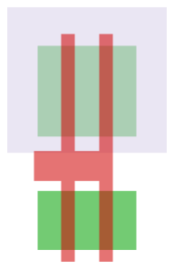
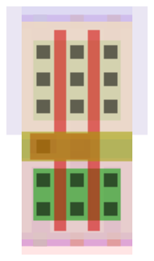
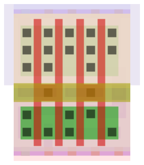

# Ders 0 — Bir çipin içine bakmak

Bu ders, donanım bilmeyen birine layout okumayı sıfırdan anlatır. Sonunda şunu
yapabiliyor olacaksın: bir GDS dosyasındaki herhangi bir dikdörtgeni gösterip
"bu şu katman, şu işe yarıyor" diyebilmek. Faz 0'ın çıkış kriteri buydu.

Teknik terimleri İngilizce bırakıyorum, çünkü araçlarda ve dökümanlarda onları
o isimle göreceksin.

---

## 1. Elimizde ne var

`puzzle/puzzle.gds` diye bir dosya. İçinde bir çipin **fiziksel çizimi** var.
Şeması yok, kodu yok, isimleri silinmiş. Sadece geometri: on binlerce dikdörtgen.

Görevimiz bu dikdörtgenlerden geriye doğru gidip devrenin ne hesapladığını
bulmak. Yani üretim talimatından tasarımı geri türetmek.

Bunu anlamak için önce şu soruyu cevaplamak gerek: **bu dikdörtgenler neyi
temsil ediyor?**

---

## 2. Çip fiziksel olarak nedir

Bir çip, silisyum bir levhanın (wafer) üzerine **katman katman** malzeme
biriktirilerek yapılır. Silisyum kumdan elde edilir — bu arada bulduğumuz
easter egg'in esprisi de buydu, `PER ARENAM AD ASTRA`, "kumdan yıldızlara".

Süreç kabaca şöyle: bir malzeme tabakası kaplanır, üzerine ışıkla bir desen
basılır, desenin dışı kazınır, geriye istenen şekil kalır. Sonra bir sonraki
tabaka. Bu işlem onlarca kez tekrarlanır.

Her tabakanın deseni bir **maske** ile belirlenir. İşte GDS dosyası tam olarak
bu maskelerin çizimidir. Yani elimizdeki şey bir devre şeması değil, **bir
üretim talimatı**.

Buradan çok önemli bir sonuç çıkıyor: dosyadaki her dikdörtgenin bir katman
numarası var, ve o numara "bu şekil hangi maskeye ait" demek. Aynı yerdeki iki
dikdörtgen farklı katmanlardaysa, fiziksel olarak üst üste duran iki farklı
malzemedir.

Bir baskı işi gibi düşün: aynı kâğıda önce mavi, sonra kırmızı, sonra siyah
basılır. Katman numarası "hangi renk" demek.

---

## 3. Transistör nedir

Çipteki tek gerçek "eleman" transistördür. Geri kalan her şey transistörleri
birbirine bağlayan tellerdir.

Kullandığımız tip **MOSFET**. Üç ucu var:

- **source** — akımın girdiği yer
- **drain** — akımın çıktığı yer
- **gate** — musluğun kolu

Çalışma mantığı bir musluk gibi: gate'e voltaj uygularsan source ile drain
arası iletken hale gelir, akım geçer. Voltajı kaldırırsan geçmez. Yani
transistör **voltajla kontrol edilen bir anahtar**.

Fiziksel yapısı şöyle: yarı iletken bir şerit vardır (buna **diff** denir,
diffusion'dan). Bu şeridin üzerinden dik olarak bir kapı geçer (**poly**,
polysilicon'dan). İkisinin arasında çok ince bir yalıtkan tabaka vardır — poly
diff'e değmez, üstünden geçer.

**İşte bu dersin en önemli cümlesi:**

> Poly'nin diff'i kestiği her yerde bir transistör vardır.

Kesişimin altında kalan diff kısmı gate'in kontrol ettiği kanaldır. Kesişimin
iki yanında kalan diff parçaları da source ve drain olur.

```
        poly (gate)
            │
    ────────┼────────      ← üstten görünüş
    │       │       │
    │ diff  │  diff │      sol parça = source
    ────────┼────────      sağ parça = drain
            │              kesişim = transistör
```

Yani layout'ta transistör diye ayrı bir şekil aramıyoruz. Transistör, iki
katmanın **kesişmesinden doğuyor**. Bunu göremezsen layout okuyamazsın.

---

## 4. Neden iki çeşit transistör var

İki tip MOSFET var:

- **NMOS** — gate'e 1 verince iletir. Sıfırı (GND'yi) iyi aktarır.
    aslında tam olarak doğrusal hareket eder. 1->1 / 0->0 şeklinde ilerler.
- **PMOS** — gate'e 0 verince iletir. Biri (VDD'yi) iyi aktarır.
    nmos'un tersi şekilde çalışır. 1->0 ve 0->1
      PMOS'un böyle zıt şekilde davranması da aslıda poly (gate) kısmında bulunan bir deliktir.

Her biri sadece bir tarafta iyi. NMOS ile 1 üretmeye çalışırsan zayıf bir 1
alırsın, PMOS ile 0 üretirsen zayıf bir 0 alırsın.

Çözüm **CMOS**: ikisini birlikte kullan. Çıkışı VDD'ye bağlaman gerektiğinde
PMOS'u aç, GND'ye bağlaman gerektiğinde NMOS'u aç. Hiçbir zaman ikisi birden
açık olmaz, dolayısıyla VDD'den GND'ye sürekli akım akmaz. Statik güç tüketimi
neredeyse sıfır. Bugün kullandığımız bütün dijital çipler bu yüzden CMOS.

Ama bir sorun var. PMOS'un source/drain bölgeleri **p tipi** katkılı olmalı ve
altında **n tipi** bir taban gerekiyor. Wafer'ın kendisi p tipi. Dolayısıyla
PMOS'ları koyabilmek için önce n tipi bir havuz kazmak gerekiyor.

O havuza **nwell** deniyor. @inv2-device'ta gördüğün büyük açık renkli lila bölge budur:
**PMOS'ların içinde oturduğu havuz.**

Bu yüzden her standard cell'in üst yarısı PMOS, alt yarısı NMOS olur. nwell
üstte olduğu için.

---

## 5. En basit kapı: invertör

Girişi tersine çeviren kapı. 0 verirsen 1, 1 verirsen 0 üretir. İki
transistörle kurulur:

```
            VDD (VPWR)
             │
           ──┴──
    A ─────┤ PMOS       A=0 → PMOS açık → Y, VDD'ye bağlanır → Y=1
           ──┬──
             ├────── Y (çıkış)
           ──┴──
    A ─────┤ NMOS       A=1 → NMOS açık → Y, GND'ye bağlanır → Y=0
           ──┬──
             │
            GND (VGND)
```

İki transistörün gate'i **ortak** — ikisi de A girişine bağlı. Drain'leri de
ortak — ikisi de Y çıkışını sürüyor. Source'ları ise beslemeye gidiyor: PMOS
VDD'ye, NMOS GND'ye.

Bu resmi aklında tut, çünkü şimdi gerçeğine bakacağız.

---

## 6. Gerçek invertörü okumak

`sky130_fd_sc_hd__inv_2` hücresinin device katmanlarını çizdirdim:



Üreten komut:

```
python tools/render_cell.py puzzle/puzzle.gds sky130_fd_sc_hd__inv_2 \
       docs/dersler/img/inv2-device.svg --layers device
```

Bu görüntüde sadece **üç renk** var, çünkü sadece üç katman çizdirdim. Toplam
dört şekil.

| Renk | Katman | Şekil olarak ne görünüyor |
|---|---|---|
| soluk lila | `nwell` | üst yarıyı kaplayan, sağdan ve soldan hücrenin dışına taşan büyük dikdörtgen |
| yeşil | `diff` | iki yatay dikdörtgen, biri üstte biri altta, aynı genişlikte |
| kırmızı | `poly` | sola doğru kuyruğu olan bir **"H"** |

Renkler benim seçimim, `tools/render_cell.py` içindeki `STYLE` tablosundan
geliyorlar. KLayout kendi varsayılanlarında başka renkler kullanır, o yüzden
renge değil **katman numarasına** güven; renk sadece göz için bir kolaylık.

### Soluk lila dikdörtgen — nwell

Resmin üst yarısını kaplıyor. Dikkat et: **sağdan ve soldan hücrenin dışına
taşıyor.** Bu bir çizim hatası değil. Hücreler yan yana dizildiğinde her birinin
lila bölgesi komşusununkiyle birleşsin diye kasten taşırılmış — havuzun sürekli
olması gerekiyor, aralarında boşluk kalmamalı.

Bölüm 4'ü hatırla: PMOS'lar n tipi bir havuzun içinde oturmak zorunda. İşte
havuz bu. Buradan tek cümlelik bir kural çıkıyor:

> Lila bölgenin **içinde** kalan her şey PMOS tarafı, **dışında** kalan her şey
> NMOS tarafı.

Bu kural tek başına, tanımadığın herhangi bir CMOS hücresinde üst/alt ayrımını
yapmanı sağlar.

### İki yeşil dikdörtgen — diff

Aynı genişlikteler ama **üstteki gözle görülür biçimde daha kalın**. Ölçersen
1.000 µm'ye karşı 0.650 µm, yaklaşık 1.5 katı.

Az önceki kuralı uygula: üstteki lila havuzun içinde kalıyor → **PMOS**.
Alttaki tamamen dışında → **NMOS**.

Peki üstteki neden daha kalın? Sebebi fizik. PMOS'ta akımı taşıyan yük
taşıyıcıları (delikler), NMOS'takilerden (elektronlar) daha yavaş hareket eder.
Aynı boyda bir PMOS, NMOS'tan daha az akım verir. Çıkışın 0'dan 1'e çıkma
süresiyle 1'den 0'a inme süresinin birbirine yakın olmasını istiyorsan PMOS'u
daha geniş çizmen gerekir.

Yani ekranda gördüğün bu boyut farkı estetik bir tercih değil, **yarı iletken
fiziğinin çizime yansımış hali.** Bundan sonra baktığın her CMOS hücresinde üst
yeşil şeridin daha kalın olduğunu göreceksin. Görmüyorsan, ya baktığın şey
standart bir CMOS hücresi değildir ya da resmi ters çevirmişsindir.

### Kırmızı "H" — poly

Tek parça, bağlantılı bir şekil. Üç bileşeni var:

- **İki dikey çubuk**, birbirine paralel, ve ikisi de yukarıdan aşağı **her iki
  yeşil dikdörtgeni de baştan sona kesiyor**
- Ortada, iki yeşil şeridin arasındaki boşlukta, bu iki çubuğu birleştiren
  **yatay bir köprü**
- Köprüden **sola uzanan kısa bir kuyruk**

Çubukların genişliği 0.150 µm — sky130'da çizilebilecek en dar poly. (Ufak not:
proses adı "130 nm" ama çizilen gate 150 nm. Proses isimleri doğrudan bir ölçüye
karşılık gelmez, tarihsel isimlendirmedir.)

### Şimdi kesişimleri say

Dersin en önemli cümlesi neydi: *poly'nin diff'i kestiği her yerde bir
transistör vardır.*

Say bakalım. İki kırmızı çubuk × iki yeşil dikdörtgen = **dört kesişim.**
Yani bu hücrede dört transistör var: alt yeşilde iki NMOS, üst yeşilde iki PMOS.

Ama invertörü iki transistörle kurmuştuk. Neden dört tane var?

Cevap kırmızının **tek parça** olmasında. İki çubuk birbirine köprüyle bağlı
olduğu için elektriksel olarak **aynı düğüm**ler — ikisi de aynı anda açılıp
kapanıyor. Aynı işi yapan iki transistörü paralel bağlamak, tek transistörün iki
katı akım vermek demek. iki katı akım verildiği zaman sinyal gecikmesi engellenmiş olur.
kısacası 0 dan 1'e geçiş demek kapasitörlerin elektrik ile dolması demektir. bunu da ne kadar hızlı yaparsak o kadar iyi olur.

Hücrenin adındaki `_2` işte bu: **drive strength 2**. Uzun bir teli veya çok
sayıda girişi sürmesi gereken bir kapı, daha güçlü versiyonundan seçilir. Aynı
mantık kapısının `_1`, `_2`, `_4`, `_8` versiyonları kütüphanede yan yana durur;
mantıkları aynı, sürme güçleri farklıdır.

Ve buradaki asıl kazanç şu: Bölüm 5'teki şemada "iki transistörün gate'i
ortak" demiştik. Şimdi bunu **göz kararı doğrulayabiliyorsun**, çünkü tek parça
kırmızı = tek elektriksel düğüm. Kuyruk da o ortak düğüme dışarıdan bağlanılacak
yer — birazdan üstünde bir temas göreceğiz.

---

## 7. Transistörleri bağlamak: katman merdiveni

Transistörler var ama birbirine bağlanmaları lazım. Bunun için üst üste binen
iletken katmanlar kullanılır. Aradaki geçişlere **via** denir (en alttakilerin
özel isimleri var).

```
   met5   ▲  en üst, en kalın, en uzak mesafeler
   via4   │
   met4   │
   via3   │
   met3   │
   via2   │
   met2   │
   via    │
   met1   │
   mcon   │
   li1    │  local interconnect, hücre içi kısa bağlantılar
   licon1 │
   diff / poly  ▼  transistörlerin kendisi
```

Merdiven aşağıdan yukarı: transistörden çıkan bağlantı `licon1` ile `li1`'e
tırmanır, `mcon` ile `met1`'e, sonra `via`, `via2`, `via3`, `via4` ile
`met2`...`met5`'e kadar çıkar.

Alt katmanlar ince ve kısa mesafeler için, üst katmanlar kalın ve uzun
mesafeler için. Besleme (VPWR/VGND) genelde üst katmanlardan dağıtılır, çünkü
kalın metal daha az direnç gösterir.

**Faz 2'de yapacağımız "connectivity extraction" tam olarak bu merdiveni
tersten tırmanmak olacak:** hangi metal parçası hangi via ile hangi metal
parçasına bağlı, oradan hangi pine iniyor. Bunu bulunca netlist elimizde olur.

Şimdi aynı invertörün tüm katmanlarıyla haline bakalım:



İlk bakışta kalabalık görünüyor, ama sistematik. Renkleri dört gruba ayırırsan
karmaşa dağılıyor.

#### Grup 1 — soluk zeminler: yapı değil, işaret

| Renk | Katman | Şekli |
|---|---|---|
| soluk pembe | `nsdm` | alt bölgeyi kaplayan geniş dikdörtgen |
| soluk mavi | `psdm` | üst bölgeyi kaplayan geniş dikdörtgen |
| şeftali | `hvtp` | üst bölgeyi kaplayan bir dikdörtgen daha |
| açık gri | `areaid.sc` | hücrenin tam sınırını çizen dikdörtgen |

Bunlar iletken değil, üzerlerinde akım akmıyor. Üretim sırasında "şu bölgeye şu
katkı maddesini uygula" diyen maskeler. `nsdm` altta N+ katkı, `psdm` üstte P+
katkı yapılacağını söylüyor.

Ve işte sana bedava bir doğrulama: Bölüm 6'da lila havuza bakıp "üstteki yeşil
PMOS" demiştik. Şimdi soluk mavi `psdm` de üstte duruyor, yani üstteki yeşil
p tipi katkılanacak — PMOS'un source/drain'i p tipi olmalıydı. **Aynı sonucu
birbirinden tamamen bağımsız iki maske söylüyor.**

Layout okumanın hissi tam olarak budur: bir yorum üretirsin, sonra onu
doğrulayan başka bir katman ararsın. İki bağımsız katman aynı şeyi söylüyorsa
yorumun doğrudur. Söylemiyorsa, yorumun yanlıştır.

Açık gri dikdörtgen ise hücrenin resmi ayak izi: 1.380 × 2.720 µm. Lila havuzun
bundan taştığını, kırmızı ve mor şekillerin ise içinde kaldığını fark et.

#### Grup 2 — hardal renkli yatay bant: npc

Tam ortada, iki yeşil şeridin arasındaki boşlukta, hücreyi baştan sona kesen
ince bir bant. Adı `npc`, "nitride poly cut".

Neden tam orada olduğunu birazdan anlayacaksın: poly'ye temas edilecek tek yer
orası, ve poly'ye temas edebilmek için önce üstündeki nitrür tabakasının
kesilmesi gerekiyor. Yani bu bant "burada poly'ye dokunacağız" demek.

#### Grup 3 — siyah ve turuncu kareler: temaslar

Hepsi aynı boyutta küçük kareler, 0.170 µm. İki renk var ve ayrımı önemli:

**Siyah kareler (`licon1`)** aşağı iner — diff'e veya poly'ye dokunur. Resimde
**üç dikey sütun** halinde diziliyorlar. Şimdi kırmızı çubuklarla birlikte
soldan sağa oku:

```
■   ▮   ■   ▮   ■
sütun  gate  sütun  gate  sütun
```

Temas sütunları ile gate'ler **sırayla** diziliyor. Bu tesadüf değil, zorunluluk:
her transistörün source'u ve drain'i gate'in iki yanında olmak zorunda. Gate'in
üstüne temas koyamazsın, orası kanal.

Buradan doğrudan okunuyor ki:
- **Ortadaki sütun** iki gate'in arasında kalıyor → iki transistörün **ortak
  drain**'i
- **Dıştaki iki sütun** → **source**'lar

Ve bir tane fazladan siyah kare var: solda, iki yeşil şeridin arasındaki
boşlukta, **kırmızı kuyruğun üstünde**. Bu diff'e değil **poly'ye** dokunuyor —
gate kontağı. Hardal bandın tam onun etrafını sarmasının sebebi bu.

**Turuncu kareler (`mcon`)** yukarı çıkar — li1'den met1'e. Sadece **en üst ve
en alt kenarda**, üçer tane. Yani yukarı çıkan tek şey besleme rayları.

#### Grup 4 — mor şekiller: li1, hikâyenin tamamı

Dört tane mor şekil var. Şekilleriyle:

| Görünüm | Ne olduğu |
|---|---|
| En üstte tam genişlikte yatay bar, ondan **aşağı sarkan iki bacak** | VPWR besleme rayı |
| En altta aynı şeyin aynadaki hali, **yukarı uzanan iki bacak** | VGND besleme rayı |
| Ortada, aşağıdan yukarı uzanan **uzun dikey şerit** | çıkış **Y** |
| Solda ortada **küçük bir dikdörtgen** | giriş **A** |

Şimdi bu dört şekli az önceki siyah sütunlarla üst üste koy ve devreyi oku:

- Üst ray'ın iki bacağı, **üstteki yeşilin dış siyah sütunlarına** iniyor
  → PMOS source'ları VPWR'a bağlandı
- Alt ray'ın iki bacağı, **alttaki yeşilin dış siyah sütunlarına** iniyor
  → NMOS source'ları VGND'ye bağlandı
- Ortadaki dikey şerit, hem alttaki hem üstteki yeşilin **orta sütununu** örtüyor
  → iki drain birbirine bağlandı, ve bu düğüm dışarı çıkıyor
- Soldaki küçük ped, kırmızı kuyruğun üstündeki **tek siyah kareyi** örtüyor
  → giriş, iki transistörün ortak gate'ine bağlandı

Şimdi Bölüm 5'teki şemaya geri dön. PMOS source'u VDD'de, NMOS source'u GND'de,
drain'ler ortak ve çıkış oradan, gate'ler ortak ve giriş oradan.

**Birebir aynı devre.** Sadece biri çizgilerle, diğeri üretilecek malzemeyle
anlatılmış. Bir layout'u "okumak" tam olarak bu çeviriyi yapabilmek demek.

#### Grup 5 — soluk küçük kareler: pin işaretleri

Mor pedlerin üstünde duran biraz daha açık renkli küçük kareler `li1.pin`,
besleme raylarındakiler `met1.pin`. Bunlar geometri değil **bildirim**: "bu
hücreye dışarıdan tam olarak buradan bağlanabilirsin."

Yerleştirme ve routing araçlarının bakacağı yer burasıdır. Bizim için de değerli
olacaklar — Faz 2'de bir teli takip ederken hangi noktanın gerçekten bir pin
olduğunu bunlardan bileceğiz.

Ve hücre bunu bize **söylüyor** da: geometrinin üstünde metin etiketleri var.

```
67/5 @(0.230, 1.190) 'A'      ← giriş pedinin üstünde
67/5 @(0.690, 0.850) 'Y'      ← çıkış şeridinin üstünde
68/5 @(0.230, 2.720) 'VPWR'
68/5 @(0.230, 0.000) 'VGND'
83/44 @(0.000, 0.000) 'inv_2' ← hücrenin kimliği
```

Bu büyük bir şans. Puzzle GDS'inde bu etiketler silinmemiş. Yani "bu geometri
hangi pin" sorusunu çözmemize gerek yok, hücre kendi pinlerini isimleriyle
söylüyor. Faz 2'nin en zahmetli kısmı büyük ölçüde hediye edilmiş durumda.

---

## 8. Standard cell nedir

Her seferinde sıfırdan transistör çizmek delilik olurdu. Onun yerine önceden
çizilmiş kapılardan oluşan bir **kütüphane** kullanılır. Bizimki
`sky130_fd_sc_hd`: SkyWater'ın 130 nm prosesi, high-density standard cell
kütüphanesi.

Bu hücrelerin ortak kuralları var:

- **Hepsi aynı yükseklikte**, bizde 2.720 µm. Böylece yan yana dizildiklerinde
  besleme rayları ve nwell'ler otomatik hizalanır ve birleşir.
- **Genişlikleri bir site genişliğinin katı**, bizde 0.460 µm. `inv_2`
  1.380 µm, yani tam 3 site.
- Girişleri solda, çıkışları sağda olacak diye bir kural yok ama pinleri hep
  erişilebilir yerlerde durur.

Akış şöyle işliyor:

```
Verilog kodu
    │  synthesis (Yosys gibi)
    ▼
netlist — "şu kütüphane hücrelerinden şunlar, şöyle bağlı"
    │  place and route
    ▼
layout — hücreler sıralara dizilmiş, aralar metalle bağlanmış
    │  GDS export
    ▼
puzzle.gds
```

Bizim yaptığımız iş bu okun tersine yürümek.

---

## 9. GDS dosyası nasıl yapılandırılmış

Üç kavramı var:

- **Cell** — isimli bir çizim. İçinde poligonlar, etiketler ve başka cell'lere
  referanslar olabilir.
- **Polygon** — bir şekil, bir katman numarası ve datatype'ı ile.
- **Reference** — "şu cell'i şu koordinata, şu döndürmeyle yerleştir".

Yani hiyerarşik: bir top cell var, o başka cell'leri çağırıyor, onlar da
başkalarını. Bir kütüphane hücresi bir kez çizilir, bin kez referans edilir.

Katman kimliği aslında **iki sayı**: layer ve datatype. `66/20` poly'nin
kendisi, `66/44` poly'ye yapılan temas. Aynı layer numarası, farklı amaç.
Tam liste [00-environment.md](../00-environment.md) içinde.

Bizim iki dosyamızda hiyerarşi **düz**: sadece top cell referans içeriyor,
altındaki her şey yaprak. Yani modül sınırları silinmiş. Tasarımdaki "şu blok
bir sayaçtı" bilgisi dosyada yok — onu geometriden ve bağlantılardan geri
çıkarmamız gerekecek. Faz 5'in zor olmasının sebebi bu.

---

## 10. Bugüne kadar ne yaptık

Üç araç yazdım. Ne işe yaradıkları:

**`tools/gds_survey.py`** — bir GDS dosyasını açıp envanterini çıkarır: hangi
cell'ler var, kaç kez yerleştirilmiş, hangi katmanlar kullanılmış, hangi
etiketler var. Tanımadığın bir layout'a ilk bakışta çalıştıracağın şey budur.
Bize PDK'nın kimliğini verdi, çünkü cell isimleri kütüphaneyi ele veriyor.

**`tools/render_cell.py`** — tek bir hücreyi SVG olarak çizer, istersen sadece
seçili katman grubunu. Bu dersteki iki görseli o üretti.

**`tools/decode_marker_row.py`** — layer 200/0'daki gizli satırı çözer.

Bulgular [00-environment.md](../00-environment.md) içinde duruyor. Öne çıkanlar:

- PDK `sky130_fd_sc_hd`. Tahmin değil, cell isimlerinde yazıyor.
- Puzzle'da 9875 yerleşim var ama bunun 8221'i via, 896'sı dolgu.
  **Anlamamız gereken gerçek mantık hücresi sadece 722.**
- 92 flip-flop, yani **92 bit durum**. Üç çeşit: 84 reset'li, 4 **set**'li,
  4 hiçbiri. Set'li olanlar önemli — reset sonrası sıfır olmayan bir değerle
  başlayan bir register var demek.
- Girişin adı `I` ve **tek bit**, yani veri seri geliyor. Çıkış `O[7:0]`,
  8 bit — cevap string'i bayt bayt çıkıyor.
- Warm-up devresi puzzle'ın küçük bir modeli: seri giriş → shift register →
  hesap → success. Kasten öyle yapılmış.
- Easter egg: `PER ARENAM AD ASTRA`.

---

## 11. Kendin dene

```bash
# Tüm envanter
python tools/gds_survey.py puzzle/warmup/04_final.gds

# Kütüphanedeki hücreleri boyutlarıyla listele
python tools/render_cell.py puzzle/puzzle.gds --list

# Bir NAND kapısını çizdir, invertörle karşılaştır
python tools/render_cell.py puzzle/puzzle.gds sky130_fd_sc_hd__nand2_2 \
       out/nand2.svg --layers device
```



NAND2'nin mantığı `Y = NOT(A AND B)`. Bunun CMOS'taki karşılığı şu: çıkışı
GND'ye çeken NMOS'lar **seri** bağlanır (ikisi de açıksa yol tamamlanır),
çıkışı VDD'ye çeken PMOS'lar **paralel** bağlanır (biri bile açıksa yol açılır).

Soru şu: bunu resimde görebilir misin?

Sırayla bak, koordinata değil renge ve şekle:

1. **Kaç tane kırmızı şekil var?** İnvertörde tek parça kırmızı vardı, çünkü tek
   girişi vardı ve iki gate'i ortaktı. Burada iki ayrı kırmızı şekil göreceksin
   — çünkü iki bağımsız giriş var. Tek parça kırmızı = tek düğüm kuralını
   hatırla. "Kaç girişi var" sorusunun layout'taki cevabı budur.
2. **Kaç kesişim var?** Her kırmızı şeklin iki parmağı var, iki yeşili de
   kesiyorlar → 8 transistör. 4 NMOS altta, 4 PMOS üstte. Yine drive strength 2,
   yani her mantıksal transistör iki kez konmuş.
3. **Yeşil dikdörtgenler.** İnvertördekiyle aynı yükseklikte, sadece daha geniş.
   Üstteki hâlâ daha kalın. Fizik değişmedi.
4. **Asıl soru: seri ile paralel farkını mor şekillerden okuyabilir misin?**

Dördüncüsünün cevabı şöyle, ve bu dersin en faydalı tek gözlemi:

**Üst yarıda (PMOS):** üstteki mor besleme rayından **aşağı sarkan bacaklar**
var, ve çıkış şeridi de yukarı uzanıyor. Temas sütunlarına sırayla bak —
bir sütuna ray iniyor, sonrakine çıkış geliyor, sonrakine yine ray. Yani
**her PMOS'un bir ucu doğrudan VPWR'da, diğer ucu doğrudan Y'de.** Hepsi
birbirinden bağımsız birer köprü. Paralel olmak tam olarak bu demek.

**Alt yarıda (NMOS):** durum farklı. Alttaki besleme rayından yukarı çıkan
**tek bir ince çıkıntı** var, sadece bir sütuna dokunuyor. Çıkış şeridi de alta
inip yalnızca bir sütuna dokunuyor. Geriye kalan sütunlar ise **kendi
aralarında, ortada duran ayrı bir mor şekille** birbirine bağlanmış.

İşte o mor şekle dikkat et: **ne besleme rayına değiyor, ne çıkışa, ne de
üstünde bir pin işareti var.** Hücrenin dışından ona ulaşmanın hiçbir yolu yok.

Bu, seri bağlantının iç düğümüdür. Devre şöyle diziliyor:

```
   Y ──[ A ]── (o mor şekil) ──[ B ]── VGND
```

Y ile VGND arasında yol açılması için **hem A hem B**'nin açık olması gerekiyor.
NAND'ın tanımı bu.

> **Genel kural:** dışarıya hiçbir yere bağlanmayan, üstünde pin işareti olmayan
> bir mor şekil gördüğünde, o bir **iç düğüm**dür ve orada seri bağlı
> transistörler vardır. Layout'ta seri/paralel ayrımını böyle yaparsın.

Bu kuralı bir kez gördüğünde `nor2`, `a21o`, `o21ai` gibi daha karmaşık
hücreleri de çözebilirsin — hepsi seri ve paralel yığınların birleşimi.
Deneyerek bak, kütüphanede hepsi var.

---

## Sonraki ders

Faz 1: **cell recognition**. Layout'taki her yerleşimi kütüphanedeki bir hücre
ismiyle eşleştirmek. Bizim dosyalarda cell isimleri duruyor, ama gerçek bir
tersine mühendislikte durmaz — bu yüzden hem kolay yoldan hem de geometriden
tanıma yoluyla yapıp ikisini karşılaştıracağız. Warm-up'ta %100 eşleşme
tutturmadan puzzle'a geçmek yok.
